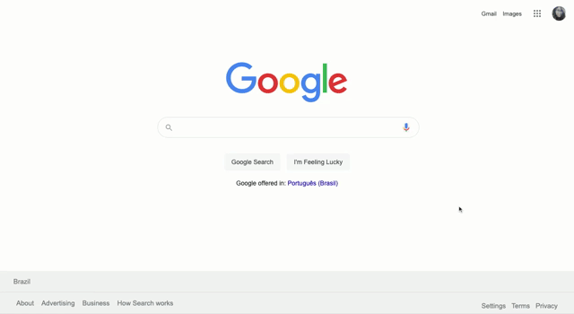

<h1 align="center">
UI Clone - Google Homepage
</h1>

<a href="https://google.com">Google Homepage</a> clone for study purposes.

## Live Preview

* [Try it out!](https://rafaelavalverde.github.io/google-homepage/) 🚀

### Preview

### Resources

- [x] HTML, CSS
- [x] Images/icons

### Reference

[The Odin Project](https://www.theodinproject.com/)
